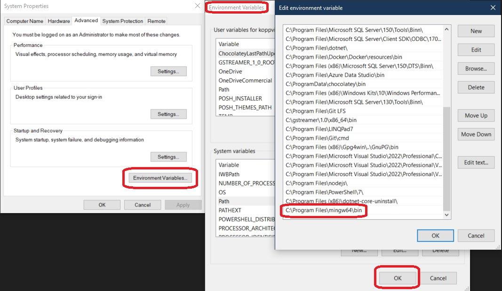
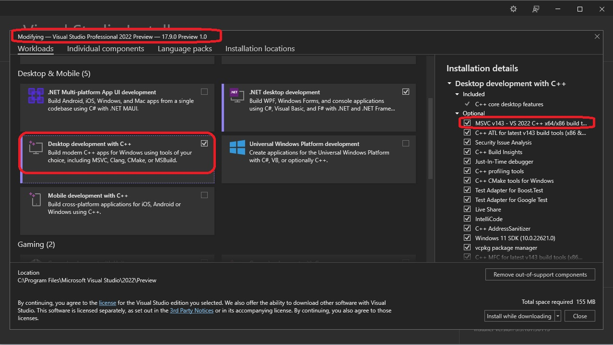
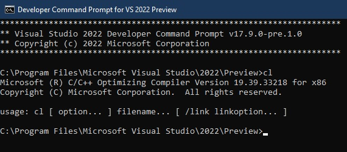

# Compilers

## Notes
1. There is no corresponding apps folder for this.

## Many compilers by different vendors.
1. Mingw
2. Msvc
3. Clang llvm

## Compiler support.
1. There are different compiler vendors.

2. Then there are their different versions released regularly.

3. Also there is C++ standard

4. So take a look at https://en.cppreference.com/w/cpp/compiler_support
   1. This gives an overview of different compilers and their support to various features.
   2. Which feature is supported by which CPP compiler.
   3. https://youtu.be/8jLOx1hD3_o?t=705

## Installing Tools needed. 
1. [GCC](https://gcc.gnu.org/). To install both GCC and Clang together, go to [WinLibs](https://winlibs.com/), scroll down to downloads section.

2. The current latest is GCC 13.2.0. You should look something like the following.
   GCC 13.2.0 (with POSIX threads) + LLVM/Clang/LLD/LLDB 17.0.5 + MinGW-w64 11.0.1 (UCRT) - release 3   (LATEST)

3. Extract, place them in some folder(I placed in Program Files), then add the path to Env Path variable.

    

4. Now open a command prompt and try the command g++ version

5. For MSVC, install Visual Studio.

   

6. Finally, check cl.exe command as follows

   

7. Install [VsCode for Windows](https://code.visualstudio.com/download). Then install the extensions as follows.

8. 

## References
1. https://youtu.be/8jLOx1hD3_o?t=678
2. https://youtu.be/8jLOx1hD3_o?t=1653
3. https://youtu.be/8jLOx1hD3_o?t=1679
4. 