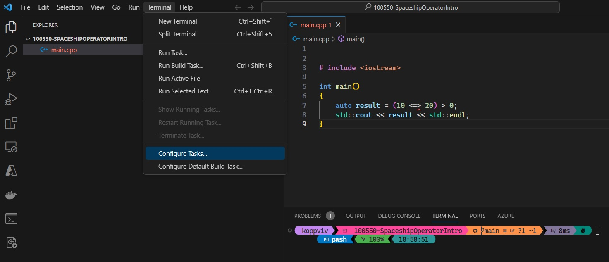
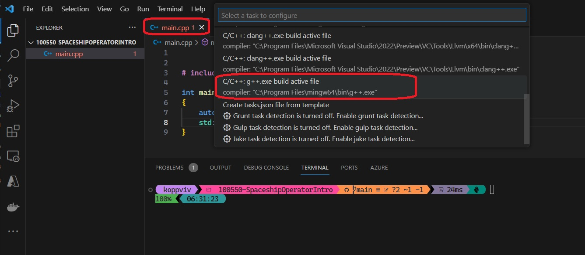
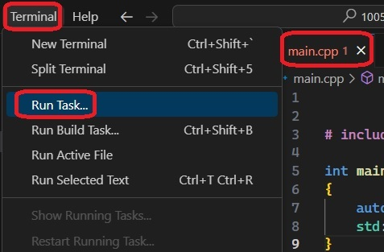
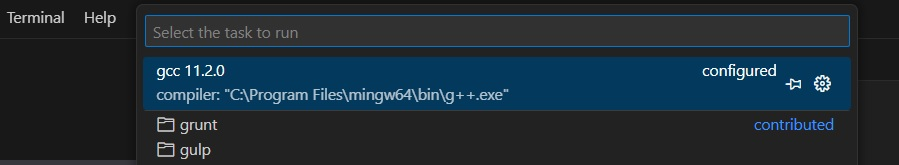

# Create Task from Terminal.

## How to create vs code build tasks from terminal.
1. Also called as Three way comparision operator.

## How this example is built
1. Create a file called main.cpp
2. Add the code as is in the file.
3. Open the vs code in that folder(where cpp file is present)
4. Ensure main.cpp file open, and let that be in the front, or just the only file open. 
5. Then in vs code, Terminal -> Configure Tasks.

    

6. Visual Studio Code will look for compilers as follows.

    

7. Click on the g++ compiler, and a .vscode folder and inside of it, a tasks.json file is created for you.

8. Change the lable to look like "gcc 11.2.0"

9. Configure gcc to use c++ 20 by adding a argument to the compiler as "-std=c++20",

10. Now run Terminal -> Run Task as follows. Ensure main.cpp is in the background

    

11. Now execute the command.

    

12. This should create a main.exe file

13. Note, you should add "-static" flag to the compiler arg. See the [SO answer](https://stackoverflow.com/a/58789865/1977871). Without this, its not outputing anything. 

14. Modifying tasks.json. You can modify your tasks.json to build multiple C++ files by using an argument like "${workspaceFolder}/*.cpp" instead of ${file}.This will build all .cpp files in your current folder. You can also modify the output filename by replacing "${fileDirname}\\${fileBasenameNoExtension}.exe" with a hard-coded filename (for example "${workspaceFolder}\\myProgram.exe").

15. https://code.visualstudio.com/docs/cpp/config-mingw#_modifying-tasksjson

## References
1. https://en.wikipedia.org/wiki/Three-way_comparison
2. https://www.geeksforgeeks.org/3-way-comparison-operator-space-ship-operator-in-c-20/
3. https://devblogs.microsoft.com/cppblog/simplify-your-code-with-rocket-science-c20s-spaceship-operator/
4. https://youtu.be/8jLOx1hD3_o?t=1816
5. https://stackoverflow.com/a/58789865/1977871
6. https://code.visualstudio.com/docs/cpp/config-mingw#_modifying-tasksjson
