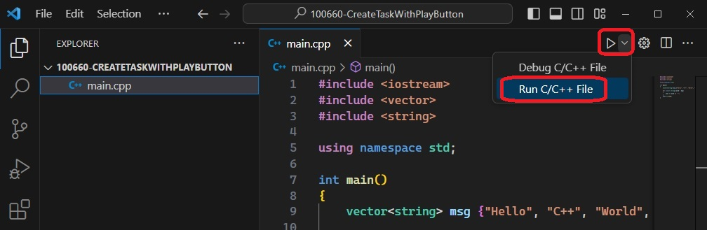
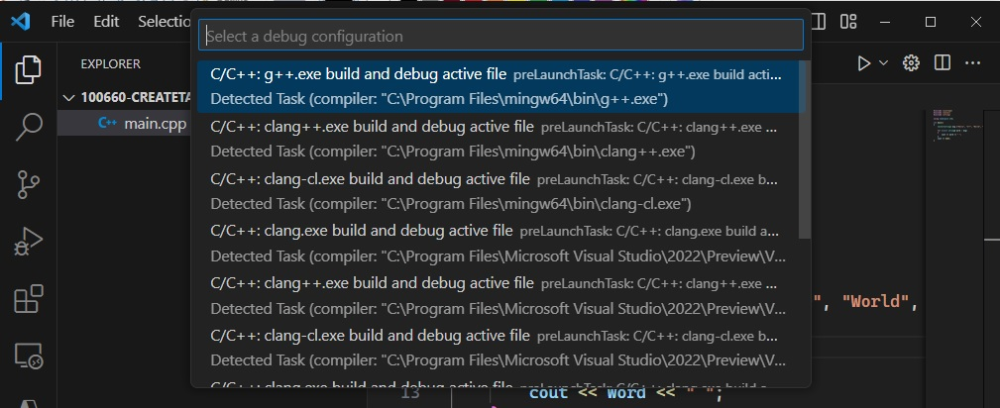

# Create Task from Terminal.
1. Describes how to create vs code build tasks from play button.

## How this example is built
1. Create a file called main.cpp, and put that code.

2. With main.cpp opned, click the play button and then select Run as below.

    

3. Choose the g++ compiler. 

    

4. Add `"-static",` to the tasks.json.

5. Now rebuild by Terminal -> Run Task ...

## References
1. https://code.visualstudio.com/docs/cpp/config-mingw#_add-a-source-code-file
2. https://code.visualstudio.com/docs/cpp/config-mingw#_add-hello-world-source-code

