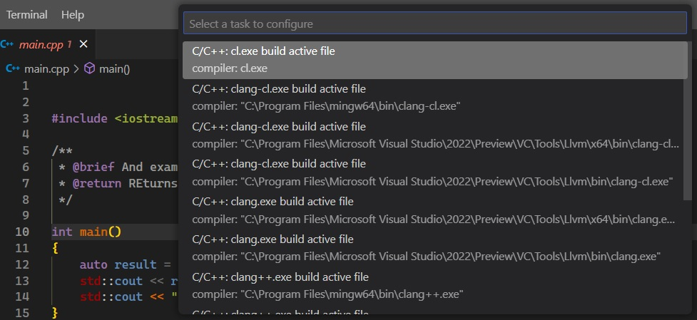

# Create Msvc Task from Terminal.

## How to create vs code build tasks from terminal with Msvc as compiler.
1. Similar to previeous, but with Msvc 

## How this example is built
1. Create a file called main.cpp

2. Add the code as is in the file.

3. Generate the task as in the earlier example. Terminal -> Configure Tasks...

4. Choose cl.exe this time as follows.

   

5. You need to add the flags to target c++20
   1. "/std:c++20",
   2. For the latest you can use, "/std:c++latest", 

6. Then finally Terminal -> Run Task. main.exe is generated. Launch that exe.

7. Note here, we did not add any static flag.

8. You can modify the task to include all of the cpp files. See the ref below.

## References
1. https://code.visualstudio.com/docs/cpp/config-mingw#_modifying-tasksjson
2. https://youtu.be/8jLOx1hD3_o?t=2732
3. https://code.visualstudio.com/docs/cpp/config-msvc
4. https://youtu.be/8jLOx1hD3_o?t=3066

