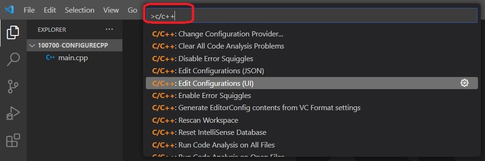
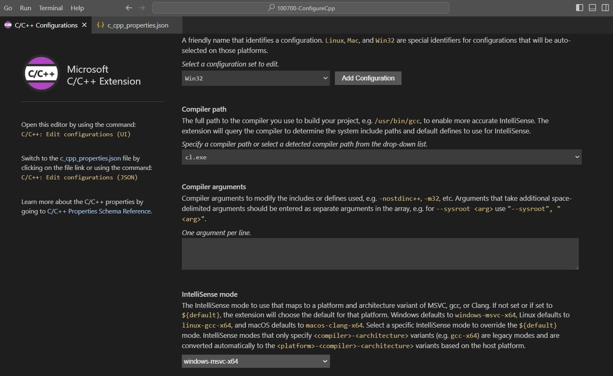
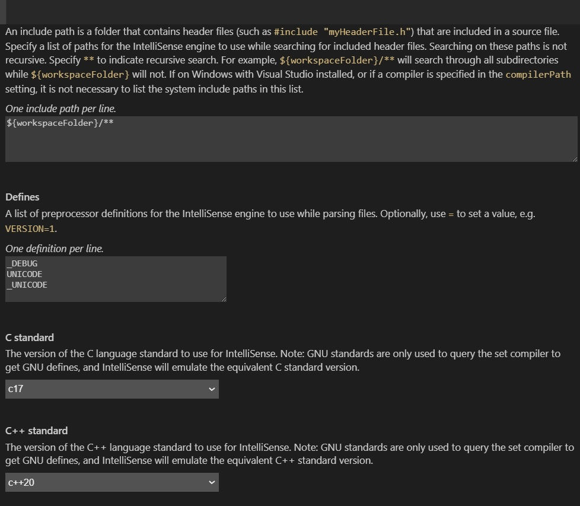

# Configure Cpp

## Steps
1. Open Command Palette... or Ctrl + Shift + P
2. Search for C/C++ and choose as follows.

    

3. Conigure as follows.

    

    

4. This will create a file called c_cpp_properties.json inside .vscode folder. Take a look into this file.

## References
1. https://youtu.be/8jLOx1hD3_o?t=3206
2. 

