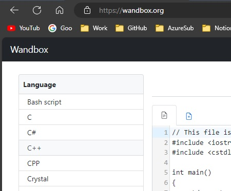
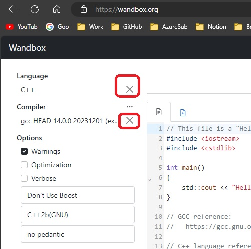
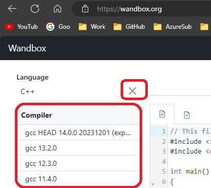
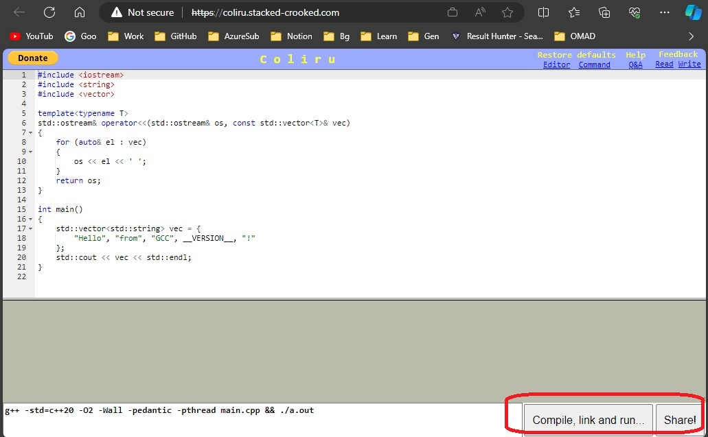
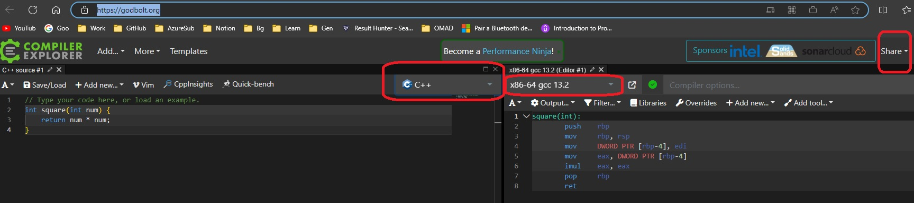

# Online Compilers

## Notes
1. There is no corresponding apps folder for this.

## Some Online Compilers
1. [Wandbox](https://wandbox.org/)
2. [Compiler Explorer](https://godbolt.org/)
3. [Coliru](https://coliru.stacked-crooked.com/)

## Wandbox
1. See the following

    

    

    

2. Coliru

    

3. Compiler Explorer. In here you can see assembly code as well. Look at this https://youtu.be/8jLOx1hD3_o?t=6167

    

4. 

## References
1. https://youtu.be/8jLOx1hD3_o?t=5746
2. https://youtu.be/8jLOx1hD3_o?t=6167

