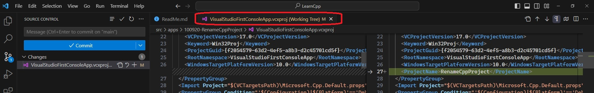
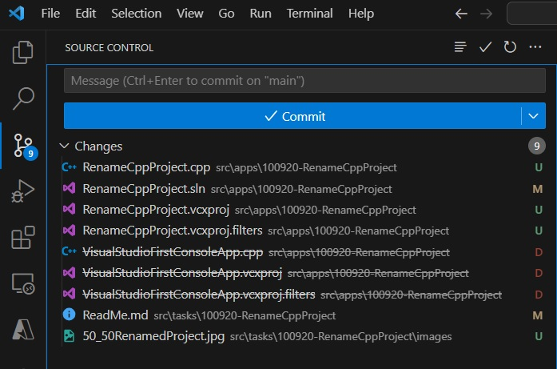

# Demos Renaming of Project steps.

## Steps
1. After copying, rename the solution file.

2. Next is to rename the project. Rename the project using Visual Studio. Solution Explorer -> Right click Project -> Rename.

3. The following happens to the project file after renaming. Note the file itself is not renamed. Only a tag is added.

    

4. So you need to unload, then rename the project file. But before reloading the project, you need to rename a project file(.vcxproj), AND Also you need to rename the (.vcxproj.filters) file as well along with it at the same time. Then you need to reload the project file on to the solution. 

        

5. Take a look at this to understand filters file.
   1. https://stackoverflow.com/q/1826901/1977871
