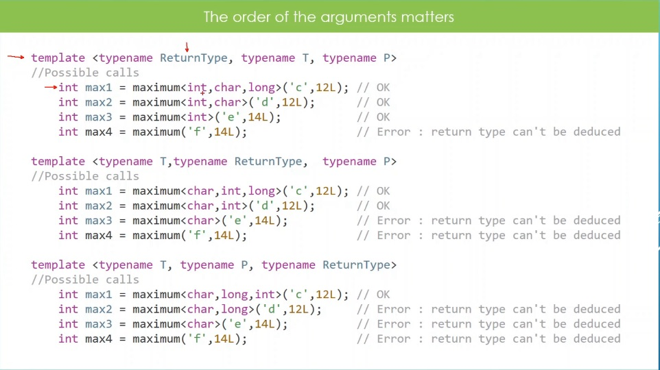

# Function Templates with Multiple Type Params

## Notes
1. One the difference of CPP function templates from the C# generics, is with the specification of type parameters while calling the function.

2. In C# the following demos. All the type parameters are needed. If you omit then its an error.

```cs
MyType myType = SomeGenericMethod<MyType, string, string>("", "");

MyType myType2 = SomeGenericMethod<MyType, string>("", ""); 
// The above gives compile time error. Using the generic method 'SomeGenericMethod<TReturn, Type1, Type2>(Type1, Type2)' requires 3 type arguments	

TReturn SomeGenericMethod<TReturn, Type1, Type2>(Type1 typeArg1, Type2 typeArg2) where TReturn : class, new()
{
    var tReturn = new TReturn();
    return tReturn;
}

public class MyType { }

```

3. But with C++, the case is differnet. Look at the following, there are 3 type parameters. 

```cpp
template <typename ReturnType, typename T, typename P>
ReturnType maximum(T a, P b)
{
    return ((a > b) ? a : b);
}

int main()
{

    int a{5};
    double b{6.7};

    auto result = maximum<int>(a, b);
    std::cout << "sizeof(result) : " << sizeof(result) << std::endl;

    return 0;
}

```

Note here, when you are declaring, there are three type parameters, but when calling, there is only one. See inside the main method.

4. Take a look at this.



## References

1. 

