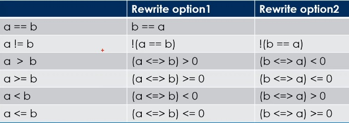

# Auto

## Notes
1. Setup your own custom three way comparision operator. 
2. Custom impimentation of three way comparision operator.
3. We might want to do this, if we dont want defaut member wise lexical grapical comparision we get if we default three way comparision opertor. 
4. And the syntax to set up without defaulting it is simple. First specify the following operarot with return type, here it is `std::partial_ordering`. Next the operator you are overloading. `operator<=>`. And then you pass your second parameter, which is going to be our second operand of our operator, in this case `(const Point& right)`. 
5. We also mark it as `const` because we dont intend to modify our member variables.


```cpp
std::partial_ordering operator<=>(const Point& right) const;
```

6. Next we impliment it as follows and the compiler will pick this when it has to do a comparision.

```cpp
std::partial_ordering Point::operator<=>(const Point& right) const{
	if(length() > right.length())
		return std::partial_ordering::greater;
	else if(length() == right.length())
		return std::partial_ordering::equivalent;
	else if(length() < right.length())
		return std::partial_ordering::less;
	else
		return std::partial_ordering::unordered;
}
```

7. The compiler will generate the greater than and less than operators. One thing we will not get is `==` operator. 
8. This is not very clear, why we need to have our own `==` operator. Need to find out.
9. The compiler want to know how we want to compare two operands. Here we want it to be based on length.

```cpp
bool Point::operator==(const Point& other) const{
    return (this->length() == other.length());
}
``` 

10. The type that we have in our member variables is double. Double by default supports partial ordering. So it makes sense to return that kind of ordering. So the return type is `std::partial_ordering`. 


```cpp
private: 
	double length() const;   // Function to calculate distance from the point(0,0)
private : 
	double m_x{};
	double m_y{};
```




## References

1. https://en.cppreference.com/w/cpp/utility/compare/partial_ordering
2. 

