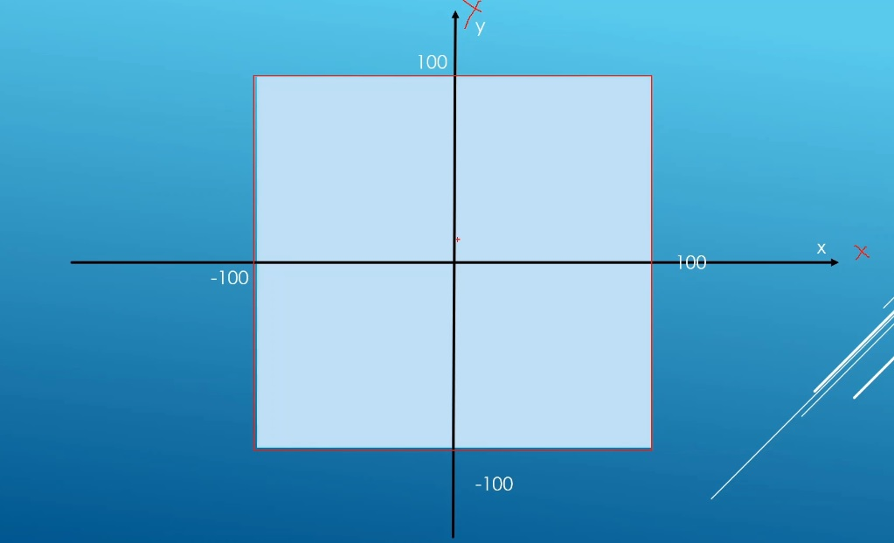
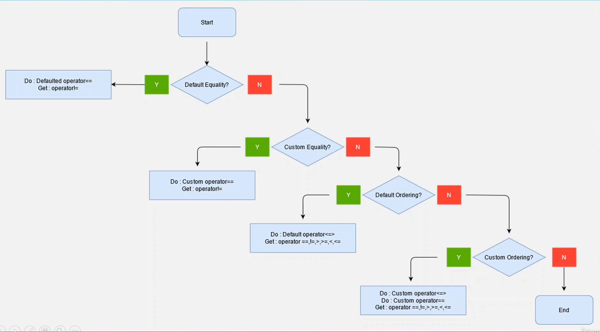

# Auto

## Notes
1. Say we have a constraint to compare points living in the following range. -100 < x,y < 100.

## Summary of Three way comparision operators module.

1. If you want to do only equality, for example, if you just want to know something is just equal to another thing, and we dont care about the greater than and less than operators, you can just setup equality operator. And if the default member wise comparision is ok for you, you dont really need to impliment anything, you can default the equality operator, the compiler will generate the != for you. 
   1. If you want equality, and the default member wise lexicographical comparision is ok for your design, then default the == operator, the complier will generate the != for you. 
2. If default member wise comparision is not going to work for you, for example we saw that, for our point class we had to compare based on the length of the point from the origin and not based on just the values in the point class, we need to setup our own equality operator. So if we wnat a custom == operator, then you need to setup your own non default == operator. Then the compiler will use that to generate != operator for you.
3. If on top of the ==, you also need >, >=, <, <=, and default member wise, lexicographical comparision is ok for your design, then its time for three way comparision operator, or the spaceship operator <=>. And again, all you need is member wise comparision, you dont need much work, you can just default three way comparision operator. Then the compiler is going to generate all the other operators you need. The compiler will give you a free == operator, which can intern be used to set up the != operator. This is really the best that you can get from the compiler, if you want all the operators and default memberwise comparision is ok for you.
4. If the default memberwise operator is not ok for you, then you need to setup your own three way comparision operator <=>. If you build your own comparision operator, the compiler is not goging to give you a free == operator you will need to put that in place yourself. 
   1. In other words, if you want ordering, and default member wise lexicographical comparison doesnot work for you, then you need to overload your own non default <=> operator. If you do this, the compiler won't generate a == operator for you though, you will need to put that in yourself. The compiler will use these to generate all the 6 comparison operators. 

## References

1. 

