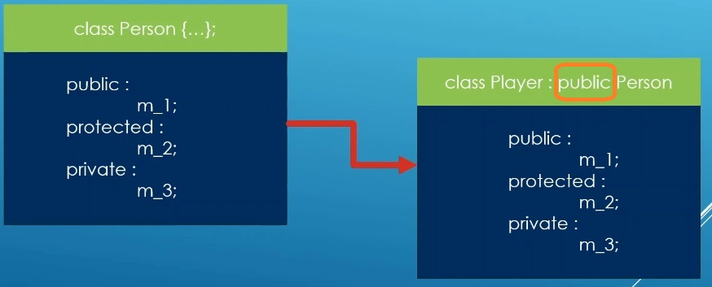
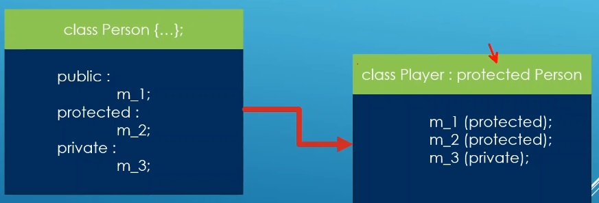
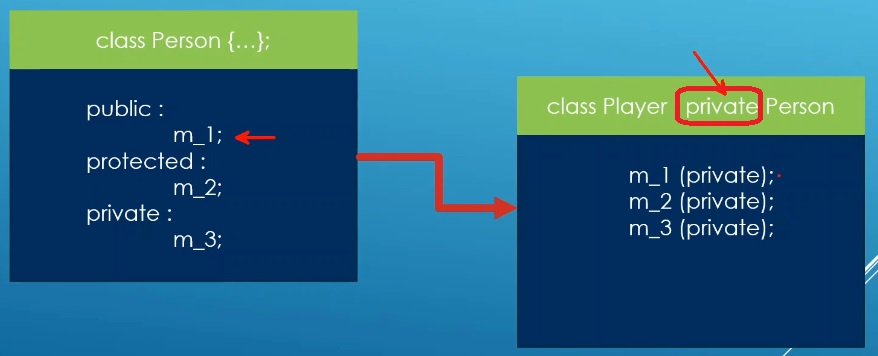

# Auto

## Notes
1. Through the base class access specifier, we can control how relaxed or constrained is the access of the base class memebers from the derived class.
2. Regardless of the access specifier, private members of base class are never accessible from derived classes.

3. Public base class

So here the player class is inheriting the person class publicically. Now say another class called FootballPlayer inherits Player. Then for the FootballPlayer class, m_3 will not be accessible. m_2 is accessible because its protected in the Player class. And m_1 is also accessible because its public in its parenet which Player

4. Protected base class

Now here the player class is inheriting the person class as protected. Now for the FootballPlayer class, m_3 will not be accessible because its private in Player. m_2 is accessible because its protected in the Player class. And m_1 is also accessible because its protected. Note that in its parent which Player it is protected. But this is public in Person class.

5. Private base class

In this specific case, the player class is inheriting the person class as private. All the inherited members in the Player class are now private. This means, FootballPlayer class which inherits from Player, will not have access to any of the members, because all of the members in the Player class are private. So In this case, we can say the Player class is selfish, because its inheriting its parent privately. so non of the Player's derived class can have access to the members it is inheriting.

## References

1. 

