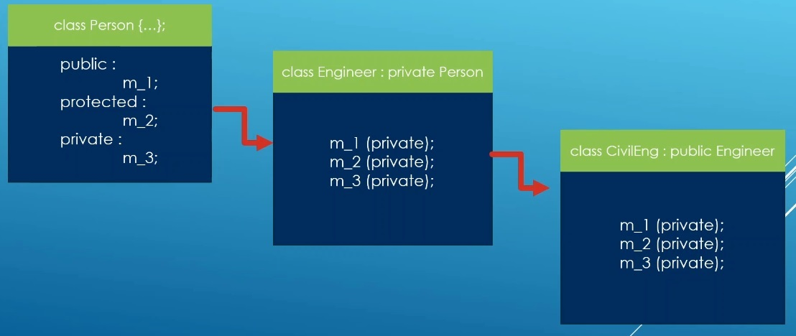

# Auto

## Notes
1. The class that does private inheritance is really selfish. Take a look at the following.

2. Here the Engineer inherits person privately. So the engineer class has inherited members from person and now these members are private because of private inheritance of its base class. 
3. m_3 will stay private in the eyes of Engineer. Which means engineer class cannot access m_3
4. Private inheritance is going to constrain what you can forward down what parent class is providing. 

## References

1. 

