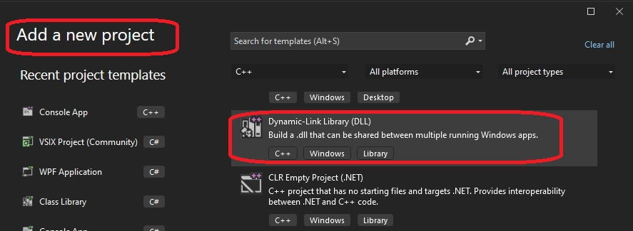
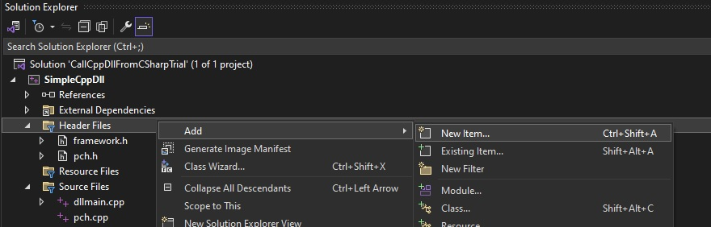
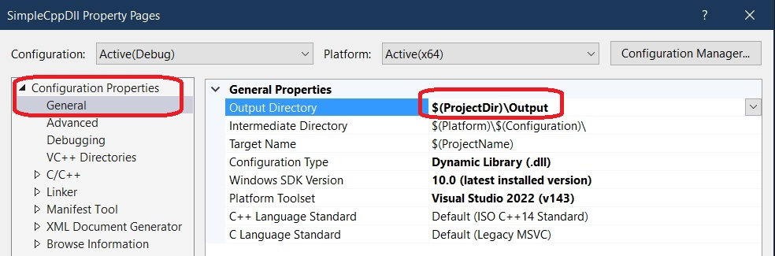
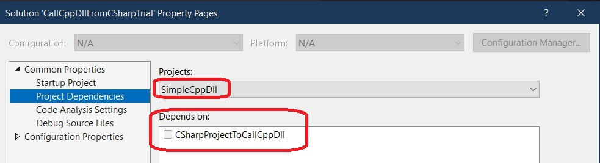
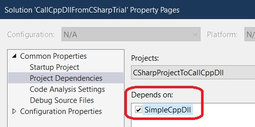

# Demos Renaming of Project steps.

## Pre Req
1. 101900-VisualStudioFirstConsoleApp

## How the solution is built.
1. Create a blank solution.
2. Create a DLL Project

    

3. Add a header file

    

4. Similarly add a cpp file.   
5. Next add a C# console project.
6. We want the output of the Cpp project to be copied to the C# output directory. So do the following.
   1. Right click the SimpleCppDll project and select properties.

    	

   2. Now Add the following target to the .net project

```xml
<Target Name="CopyDLLs" AfterTargets="Build">
	<Message Text="Executing CopyDLLs task $(TargetDir)" Importance="High" />
	<ItemGroup>
		<MySourceFiles Include="..\SimpleCppDll\Output\**\*.*"/>
	</ItemGroup>
	<Copy
		SourceFiles="@(MySourceFiles)"
		DestinationFolder="$(OutDir)" />

	<Message Text="Copied build files" Importance="High" />
	
</Target>

```

   3. Finally the build sequence of the solution. Right Click the solution and select properties. 

     	

		and then

     	

   4. Note that setting up the build dependencies as the previous step is alone not suffecient for the Cpp dlls to be copied to the output dir of the C# project. We need to explicitely copy and this we had done in step 2 by creating the target `<Target Name="CopyDLLs" AfterTargets="Build">`
1.  

## Reference
1. https://www.youtube.com/watch?v=5LpehkumdzA


## Todo
1. Need to understand what `#pragma once` means. See any hader file. You can find this at the top. 
2. Take a look at the following.
```c++
#include <comdef.h>

extern "C" __declspec(dllexport) int Multiply(int numberOne, int numberTwo);
extern "C" __declspec(dllexport) BSTR GetCalOptions();
```
Some questions from the above are as follows.

1.  What is `extern "C"`?
2.  What is `comdef.h`?
3.  What is `__declspec(dllexport)`?
4.  What is `BSTR`?
5.  What is a header file?


102950-VariablesAndDataTypes

